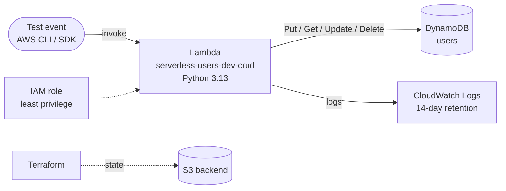

# Serverless CRUD with Terraform: AWS Lambda + DynamoDB


A serverless back end, deployed entirely with **Terraform**: a Python Lambda function that creates, reads, updates and deletes users in a DynamoDB table. Permissions, logging and naming are handled as code.

## Architecture



| Resource | Terraform | Details |
|---|---|---|
| DynamoDB table | `aws_dynamodb_table.users` | Partition key `username`, sort key `last_name`, on-demand billing |
| Lambda function | `aws_lambda_function.users_crud` | Python 3.13, table name passed as an environment variable |
| IAM role + policy | `aws_iam_role.lambda_exec` | Only the 4 DynamoDB actions used, on this table only |
| Log group | `aws_cloudwatch_log_group.lambda` | Retention set by variable (default 14 days) |
| Remote state | `backend "s3"` | State stored in S3, not on a laptop |

## How the function works

The function is called with an event that contains an `action`. Sample events are in [`events/`](events/).

| Action | Required fields | Success | Errors |
|---|---|---|---|
| `create` | `username`, `first_name`, `last_name`, `age`, `account_type` | `201` | `400` invalid input · `409` user already exists |
| `read` | `username`, `last_name` | `200` + item | `404` not found |
| `update` | `username`, `last_name`, `age` | `200` | `404` not found |
| `delete` | `username`, `last_name` | `200` | |

Example (`events/create.json`):

```json
{
  "action": "create",
  "username": "janedoe",
  "first_name": "Jane",
  "last_name": "Doe",
  "age": 25,
  "account_type": "standard_user"
}
```

## Deploy

### Prerequisites

- Terraform 1.5 or later
- AWS CLI configured (`aws configure`)
- An S3 bucket for the Terraform state. Update the `bucket` in [`terraform.tf`](terraform.tf), or remove the `backend` block to keep the state locally.

### Steps

```bash
cp example.tfvars terraform.tfvars   # optional: change names, environment, etc.
terraform init
terraform plan
terraform apply
```

### Test it

From the AWS console: open the function, go to **Test**, and paste one of the events from `events/`.

From the AWS CLI:

```bash
FN=$(terraform output -raw lambda_function_name)

aws lambda invoke --function-name $FN \
  --cli-binary-format raw-in-base64-out \
  --payload file://events/create.json out.json && cat out.json

aws lambda invoke --function-name $FN \
  --cli-binary-format raw-in-base64-out \
  --payload file://events/read.json out.json && cat out.json
```

### Clean up

```bash
terraform destroy
```

## Testing

```bash
pip install -r requirements-dev.txt
pytest -v
```

The tests use [moto](https://github.com/getmoto/moto) to simulate DynamoDB, so no AWS account is needed. They run the four sample events end to end and check every error case (400, 404, 409).

GitHub Actions runs `terraform fmt`, `terraform validate` and the Python tests on every push.

## Project structure

```
.
├── terraform.tf          # Terraform + provider versions, S3 backend
├── provider.tf           # AWS provider with default tags
├── variables.tf          # Input variables (with validation)
├── main.tf               # DynamoDB, IAM, CloudWatch Logs, Lambda
├── outputs.tf            # Function name/ARN, table name, log group
├── example.tfvars        # Example variable values
├── lambda/
│   └── lambda_dynamodb.py   # CRUD handler
├── events/               # Sample test events (create/read/update/delete)
├── tests/                # pytest unit tests (moto)
├── examples/sns-notify/  # Separate SNS example (not deployed)
└── .github/workflows/    # CI pipeline
```

## Design decisions

- **Least privilege.** The role can only `PutItem`, `GetItem`, `UpdateItem` and `DeleteItem` on the `users` table, and write logs to its own log group. No wildcard (`*`) actions or resources.
- **Safe writes.** `create` refuses to overwrite an existing user, and `update` refuses to create a user that doesn't exist. Both use DynamoDB condition expressions.
- **Input validation.** Missing fields or an invalid `age` return a clear `400` message instead of crashing the function.
- **Configurable.** Names, environment, timeout, memory, log level and log retention are variables. Every resource is tagged with `Project`, `Environment` and `ManagedBy`.
- **Safe refactoring.** `moved` blocks keep the existing Terraform state when resources are renamed.

## Skills demonstrated

Terraform · AWS Lambda · DynamoDB · IAM least privilege · CloudWatch · Python (boto3) · Unit testing (pytest, moto) · CI/CD with GitHub Actions · Remote state (S3)
